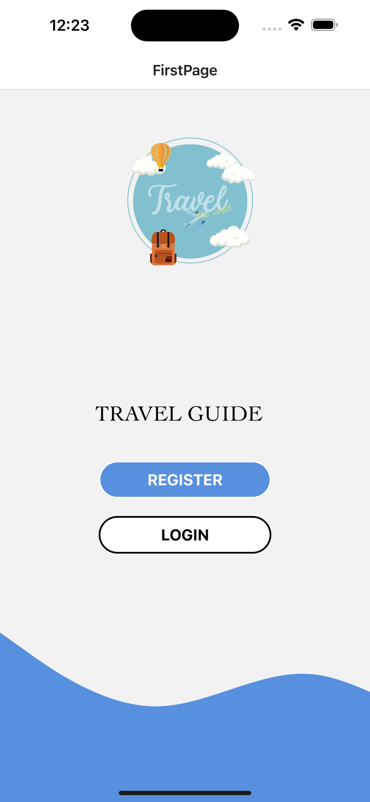
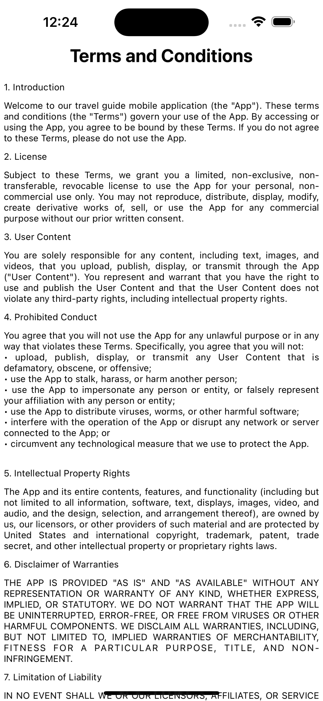
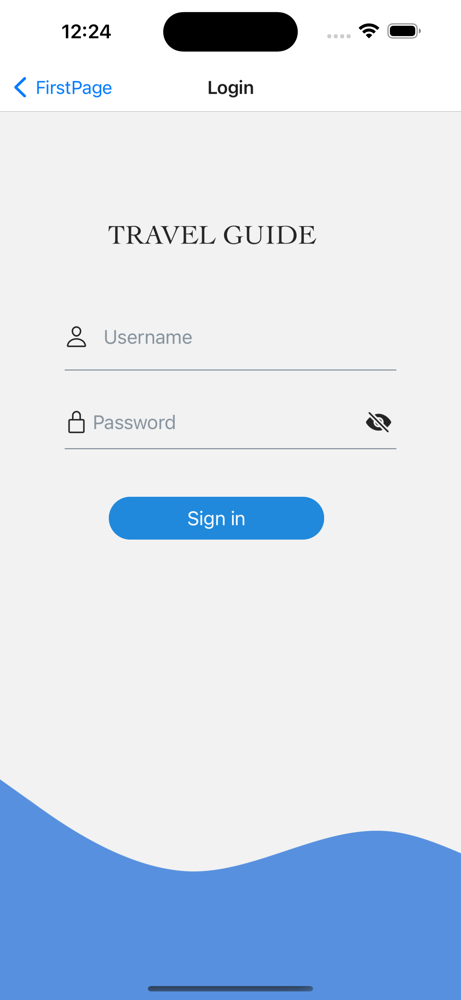
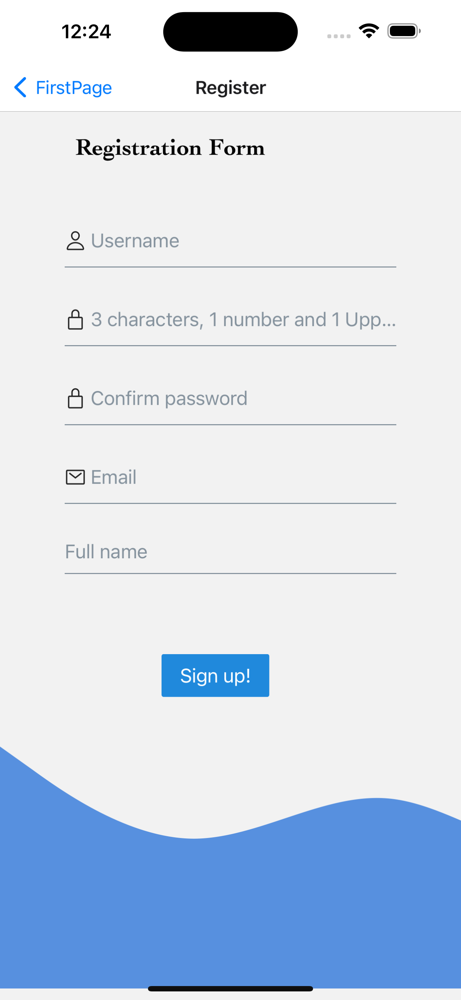
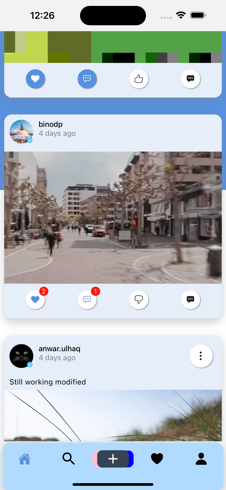
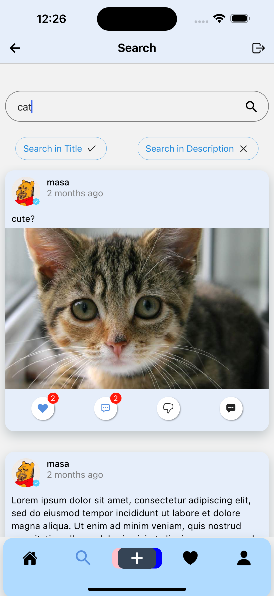
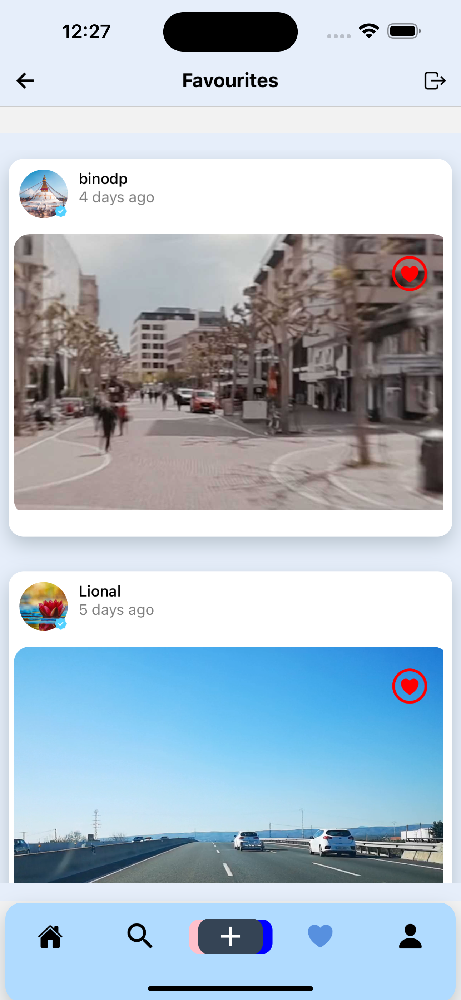
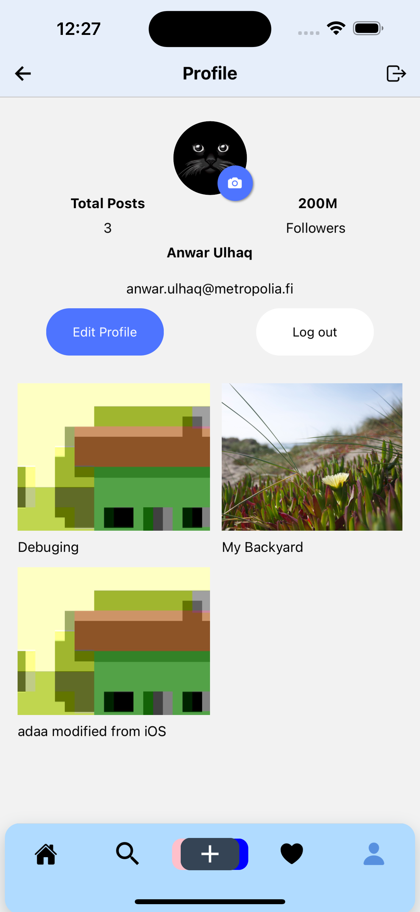

# Travel-Guide

## Description
Travel guide is React Native media share application where users can share images, videos and descriptions about their post among other users. Users can give feedback to other users through comments and likes.

## Feature List
* [X] User can go through post feed, search any post or user
* [X] User can upload a new image or video with title, description
* [X] User can communicate with other users through liking, commenting in the post.
* [X]  User can modify, delete own's post, comment or dislike already liked post.
* [X] User can visit own's or other user's profile page
* [X] User can upload new avatar, modify username and password
* [ ] Could not do this

## Technologies

1. React Native
2. react native component
3. Add more.... Fonts, Navigation......

## Prerequisite

There are a couple of things you need to install to set up the environment for React Native.

1. NodeJS
2. NPM


## How to Build?

Be sure to update the versions (for each of Android and iOS) in app.json in the root, between build updates.

You can build the app using expo commands:

### For Android

#### * Android Emulator

To run it on your Android emulator, first build your project with the apk flag by running,
```
expo build:android -t apk // for building apk.
```
and you can drag and drop the .apk into the emulator.

#### * Android Device

To run it on your Android device, make sure you have the Android platform tools installed along with ``adb``, then just run
```
expo build:android -t app-bundle // for building bundle
```

These commands directly build your app but you have to create an account on expo. Also for more details regarding building for android you can follow this doc [Expo Android Build Doc](https://docs.expo.io/distribution/building-standalone-apps/#if-you-choose-to-build-for-android). This has a step by step instructions to build your app.

Once done, if you want to push to the Google PlayStore, use:

```
expo upload:android
```
with [USB debugging enabled on your device](https://developer.android.com/studio/run/device.html#device-developer-options) and the device plugged in.

### For IOS

If building with XCode, first do the following on a newly installed copy of the code, in the ios folder:

```
pod install
```

#### NOTE: In XCode, be sure to set the correct development team account:


```
expo build:ios -t archive // for app store
expo build:ios -t simulator // for simulation
```

For more details regarding building for ios you can follow this doc [Expo IOS Build Doc](https://docs.expo.io/distribution/building-standalone-apps/#if-you-choose-to-build-for-ios). This has a step by step instructions to build your app.

_Or you can directly build ios and android app from xcode and android studio directly which is same as you do for standalone app._

Once done, if you want to push to the Apple AppStore, use:

```
expo upload:ios
```

After installing NodeJS and NPM successfully in your system you can proceed.

## How to run?

This app has been built with [expo](https://expo.io/learn) (a wrapper for react-native). To run this app, first you need to install expo-cli on your local machine and then expo app on your phone.

###On local machine

```
npm install -g expo-cli
```

Now, clone the repo, install packages and start:

```
git clone https://github.com/Argier96/Travel-Guide.git
cd Travel-Guide
npm install
npm start
```

###On Android phone
Now download the expo app from [android play store](https://play.google.com/store/apps/details?id=host.exp.exponent) or [ios app store](https://apps.apple.com/us/app/expo-client/id982107779) then open expo app on the phone. Scan the QR code from the metro bundle in http://localhost:19000, You will be able to run the app now.


## Project contributors
- [Binod Panta](https://github.com/frozenfi)
- [Ritesh Ghimire](https://github.com/Argier96)
- [Anwar Ulhaq](https://github.com/anwar-ulhaq)

## Backend documentation
- [WBMA](https://media.mw.metropolia.fi/wbma/docs)

## Known Bugs

* App not responsive on small screen devices.

## Screenshots

 
 
 
 

## Demo (Expo server)

You need to download Expo client app from Google PlayStore and scan this QR code.


